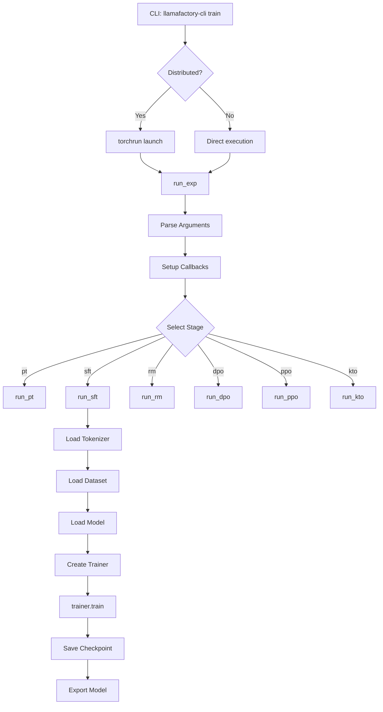

# Blog 2: Deep Dive: The Training Pipeline

**Analysis Commit SHA:** `45f0437`
**Reading Time:** ~12 minutes

---

## What You'll Learn

- How training is orchestrated from CLI to completion
- The callback system and how to extend it
- Different training stages and their implementations
- Distributed training setup and execution

---

## Introduction

In our previous post, we explored LLaMA-Factory's layered architecture. Now let's dive deep into what makes this framework tick: the training pipeline. We'll trace the complete execution path from when you run `llamafactory-cli train` to when your model is saved.

Understanding this flow is essential whether you're debugging training issues, extending the framework, or optimizing performance.

---

## The Training Entry Point

Everything starts at the CLI. When you run:

```bash
llamafactory-cli train examples/train_lora/llama3_lora_sft.yaml
```

The execution flows through several stages:

```python
# src/llamafactory/cli.py (lines 10-20)
def main():
    args = sys.argv[1:]
    if args[0] in COMMANDS:
        # Route to launcher
        launcher.launch()
```

[View source: cli.py](https://github.com/hiyouga/LLaMA-Factory/blob/45f0437/src/llamafactory/cli.py#L10-L20)

The launcher then determines whether distributed training is needed:

```python
# src/llamafactory/launcher.py (lines 80-120)
def launch() -> None:
    args = parse_args()

    if args.command == "train":
        # Check if distributed training is required
        if should_use_torchrun(args):
            # Launch with torchrun for distributed training
            master_addr = os.getenv("MASTER_ADDR", "127.0.0.1")
            master_port = os.getenv("MASTER_PORT", get_free_port())

            cmd = [
                sys.executable, "-m", "torch.distributed.run",
                "--nnodes", str(args.nnodes),
                "--nproc_per_node", str(args.nproc_per_node),
                # ... more torchrun args
                "llamafactory.train", "--args", serialized_args
            ]
            subprocess.run(cmd)
        else:
            # Direct execution for single-GPU
            run_exp(dict_config=OmegaConf.to_container(args))
```

[View source: launcher.py](https://github.com/hiyouga/LLaMA-Factory/blob/45f0437/src/llamafactory/launcher.py#L80-L120)

---

## The Training Orchestrator

The heart of training is `train/tuner.py`:

```python
# src/llamafactory/train/tuner.py (lines 30-90)
def run_exp(dict_config: dict[str, Any]) -> None:
    """Main training entry point."""
    callbacks: list[Any] = []

    # Parse and validate arguments
    model_args, data_args, training_args, finetuning_args, generating_args = \
        get_train_args(dict_config)

    # Add standard callbacks
    callbacks.append(LogCallback())

    if finetuning_args.pissa_convert:
        callbacks.append(PissaConvertCallback())

    if finetuning_args.use_swanlab:
        callbacks.append(get_swanlab_callback(finetuning_args))

    if finetuning_args.early_stopping_steps:
        callbacks.append(EarlyStoppingCallback(
            early_stopping_patience=finetuning_args.early_stopping_steps
        ))

    # Add config reporter (must be last)
    callbacks.append(ReporterCallback(
        model_args, data_args, finetuning_args, generating_args
    ))

    # Route to appropriate training stage
    if finetuning_args.stage == "pt":
        run_pt(model_args, data_args, training_args, finetuning_args, generating_args, callbacks)
    elif finetuning_args.stage == "sft":
        run_sft(model_args, data_args, training_args, finetuning_args, generating_args, callbacks)
    elif finetuning_args.stage == "rm":
        run_rm(model_args, data_args, training_args, finetuning_args, generating_args, callbacks)
    elif finetuning_args.stage == "dpo":
        run_dpo(model_args, data_args, training_args, finetuning_args, generating_args, callbacks)
    elif finetuning_args.stage == "ppo":
        run_ppo(model_args, data_args, training_args, finetuning_args, generating_args, callbacks)
    elif finetuning_args.stage == "kto":
        run_kto(model_args, data_args, training_args, finetuning_args, generating_args, callbacks)
```

[View source: tuner.py](https://github.com/hiyouga/LLaMA-Factory/blob/45f0437/src/llamafactory/train/tuner.py#L30-L90)

---

## Stage-Specific Workflows

Each training stage has its own workflow implementation. Let's examine the most common one—SFT:

### Supervised Fine-Tuning (SFT)

```python
# src/llamafactory/train/sft/workflow.py (lines 20-100)
def run_sft(
    model_args: "ModelArguments",
    data_args: "DataArguments",
    training_args: "Seq2SeqTrainingArguments",
    finetuning_args: "FinetuningArguments",
    generating_args: "GeneratingArguments",
    callbacks: list["TrainerCallback"],
) -> None:
    # Step 1: Load tokenizer
    tokenizer_module = load_tokenizer(model_args)
    tokenizer = tokenizer_module["tokenizer"]

    # Step 2: Get dataset with processor
    dataset_module = get_dataset(
        template=get_template_and_fix_tokenizer(tokenizer, data_args, model_args),
        model_args=model_args,
        data_args=data_args,
        training_args=training_args,
        stage="sft",
        **tokenizer_module,
    )

    # Step 3: Load model with adapters
    model = load_model(
        tokenizer,
        model_args,
        finetuning_args,
        training_args.do_train,
    )

    # Step 4: Setup data collator
    data_collator = SFTDataCollatorWith4DAttentionMask(
        template=dataset_module["template"],
        pad_to_multiple_of=8 if training_args.do_train else None,
        label_pad_token_id=IGNORE_INDEX,
        **tokenizer_module,
    )

    # Step 5: Create trainer
    trainer = Seq2SeqTrainer(
        model=model,
        args=training_args,
        finetuning_args=finetuning_args,
        data_collator=data_collator,
        callbacks=callbacks,
        **dataset_module,
        **tokenizer_module,
    )

    # Step 6: Training
    if training_args.do_train:
        train_result = trainer.train(
            resume_from_checkpoint=training_args.resume_from_checkpoint
        )
        trainer.save_model()
        trainer.log_metrics("train", train_result.metrics)
        trainer.save_metrics("train", train_result.metrics)
        trainer.save_state()

    # Step 7: Evaluation
    if training_args.do_eval:
        metrics = trainer.evaluate(metric_key_prefix="eval")
        trainer.log_metrics("eval", metrics)
        trainer.save_metrics("eval", metrics)

    # Step 8: Prediction
    if training_args.do_predict:
        predict_results = trainer.predict(
            dataset_module["eval_dataset"],
            metric_key_prefix="predict"
        )
        trainer.log_metrics("predict", predict_results.metrics)
        trainer.save_metrics("predict", predict_results.metrics)
```

[View source: sft/workflow.py](https://github.com/hiyouga/LLaMA-Factory/blob/45f0437/src/llamafactory/train/sft/workflow.py#L20-L100)

### DPO (Direct Preference Optimization)

DPO differs by using pairwise data and a specialized trainer:

```python
# src/llamafactory/train/dpo/workflow.py (lines 20-80)
def run_dpo(
    model_args, data_args, training_args, finetuning_args, generating_args, callbacks
) -> None:
    # Similar setup, but with pairwise dataset
    dataset_module = get_dataset(
        # ... args ...
        stage="rm",  # Uses pairwise processor
    )

    # DPO uses reference model for KL divergence
    ref_model = None
    if finetuning_args.ref_model is not None:
        ref_model = load_model(
            tokenizer,
            model_args,
            finetuning_args,
            is_trainable=False,  # Frozen reference
        )

    # Use DPOTrainer from TRL
    trainer = DPOTrainer(
        model=model,
        ref_model=ref_model,
        args=training_args,
        beta=finetuning_args.dpo_beta,
        loss_type=finetuning_args.dpo_loss_type,
        # ... other DPO-specific args
    )
```

[View source: dpo/workflow.py](https://github.com/hiyouga/LLaMA-Factory/blob/45f0437/src/llamafactory/train/dpo/workflow.py#L20-L80)

### PPO (Reinforcement Learning)

PPO is the most complex, involving multiple models:

```python
# src/llamafactory/train/ppo/workflow.py (lines 30-120)
def run_ppo(
    model_args, data_args, training_args, finetuning_args, generating_args, callbacks
) -> None:
    # Load policy model
    model = load_model(tokenizer, model_args, finetuning_args, True)

    # Load reward model
    reward_model = load_model(
        tokenizer,
        model_args,
        finetuning_args,
        is_trainable=False,
        add_valuehead=True,  # RM has value head
    )

    # Load reference model for KL penalty
    ref_model = load_model(
        tokenizer, model_args, finetuning_args, is_trainable=False
    )

    # Create PPO config
    ppo_config = PPOConfig(
        model_name=model_args.model_name_or_path,
        learning_rate=training_args.learning_rate,
        batch_size=training_args.per_device_train_batch_size,
        # ... PPO hyperparameters
    )

    # PPO Trainer from TRL
    trainer = PPOTrainer(
        config=ppo_config,
        model=model,
        ref_model=ref_model,
        tokenizer=tokenizer,
        dataset=dataset,
        # ...
    )

    # Custom PPO training loop
    for batch in trainer.dataloader:
        # Generate responses
        response_tensors = trainer.generate(batch["input_ids"])

        # Get rewards from reward model
        rewards = compute_reward(reward_model, batch, response_tensors)

        # PPO step
        stats = trainer.step(batch["input_ids"], response_tensors, rewards)
```

[View source: ppo/workflow.py](https://github.com/hiyouga/LLaMA-Factory/blob/45f0437/src/llamafactory/train/ppo/workflow.py#L30-L120)

---

## The Callback System

Callbacks provide hooks into the training lifecycle. LLaMA-Factory uses HuggingFace's callback interface:

### LogCallback - Training Metrics

```python
# src/llamafactory/train/callbacks.py (lines 150-250)
class LogCallback(TrainerCallback):
    """Logs training progress and metrics."""

    def __init__(self):
        self.start_time = 0
        self.cur_steps = 0
        self.max_steps = 0
        self.thread_pool = None
        self.webui_mode = is_env_enabled("LLAMABOARD_ENABLED")

    def on_train_begin(self, args, state, control, **kwargs):
        self.start_time = time.time()
        self.max_steps = state.max_steps

        # Clean previous logs if overwriting
        if args.overwrite_output_dir and os.path.isdir(args.output_dir):
            for file in [TRAINER_LOG, RUNNING_LOG]:
                path = os.path.join(args.output_dir, file)
                if os.path.isfile(path):
                    os.remove(path)

        # Start async logging thread
        self._create_thread_pool(args.output_dir)

    def on_log(self, args, state, control, **kwargs):
        # Calculate timing
        elapsed = time.time() - self.start_time
        remaining = (self.max_steps - state.global_step) * (elapsed / state.global_step)

        # Prepare metrics
        logs = {
            "current_steps": state.global_step,
            "total_steps": self.max_steps,
            "loss": state.log_history[-1].get("loss"),
            "lr": state.log_history[-1].get("learning_rate"),
            "epoch": state.log_history[-1].get("epoch"),
            "elapsed_time": str(timedelta(seconds=int(elapsed))),
            "remaining_time": str(timedelta(seconds=int(remaining))),
        }

        # Add throughput if available
        if state.num_input_tokens_seen:
            logs["throughput"] = state.num_input_tokens_seen / elapsed

        # Write to JSONL file asynchronously
        self.thread_pool.submit(self._write_log, args.output_dir, logs)
```

[View source: callbacks.py](https://github.com/hiyouga/LLaMA-Factory/blob/45f0437/src/llamafactory/train/callbacks.py#L150-L250)

### ReporterCallback - W&B/SwanLab Integration

```python
# src/llamafactory/train/callbacks.py (lines 340-400)
class ReporterCallback(TrainerCallback):
    """Reports configuration to experiment trackers."""

    def __init__(self, model_args, data_args, finetuning_args, generating_args):
        self.model_args = model_args
        self.data_args = data_args
        self.finetuning_args = finetuning_args
        self.generating_args = generating_args

        # Set default W&B project
        os.environ["WANDB_PROJECT"] = os.getenv("WANDB_PROJECT", "llamafactory")

    def on_train_begin(self, args, state, control, **kwargs):
        if not state.is_world_process_zero:
            return

        # Log configs to W&B
        if "wandb" in args.report_to:
            import wandb
            wandb.config.update({
                "model_args": self.model_args.to_dict(),
                "data_args": self.data_args.to_dict(),
                "finetuning_args": self.finetuning_args.to_dict(),
                "generating_args": self.generating_args.to_dict(),
            })

        # Log configs to SwanLab
        if self.finetuning_args.use_swanlab:
            import swanlab
            swanlab.config.update({
                "model_args": self.model_args.to_dict(),
                # ... same pattern
            })
```

[View source: callbacks.py](https://github.com/hiyouga/LLaMA-Factory/blob/45f0437/src/llamafactory/train/callbacks.py#L340-L400)

---

## Distributed Training

LLaMA-Factory supports distributed training through torchrun:

### When is Distributed Training Used?

```python
# src/llamafactory/launcher.py (lines 40-60)
def should_use_torchrun(args) -> bool:
    """Determine if distributed training is needed."""
    # Explicit environment variable
    if is_env_enabled("FORCE_TORCHRUN"):
        return True

    # Multiple GPUs available
    if torch.cuda.device_count() > 1:
        return True

    # DeepSpeed requires distributed
    if args.deepspeed:
        return True

    return False
```

[View source: launcher.py](https://github.com/hiyouga/LLaMA-Factory/blob/45f0437/src/llamafactory/launcher.py#L40-L60)

### Elastic Restart Support

For fault tolerance in large clusters:

```python
# src/llamafactory/launcher.py (lines 100-130)
def run_distributed():
    # Use rendezvous for elastic training
    cmd = [
        sys.executable, "-m", "torch.distributed.run",
        "--rdzv_backend", "c10d",
        "--rdzv_endpoint", f"{master_addr}:{master_port}",
        "--rdzv_id", args.rdzv_id or "default",
        "--nnodes", f"{args.min_nodes}:{args.max_nodes}",  # Elastic
        "--nproc_per_node", str(args.nproc_per_node),
        # ...
    ]
```

[View source: launcher.py](https://github.com/hiyouga/LLaMA-Factory/blob/45f0437/src/llamafactory/launcher.py#L100-L130)

### Rank-Aware Logging

Only rank 0 should log to avoid duplication:

```python
# src/llamafactory/extras/logging.py (lines 150-170)
def info_rank0(self, *args, **kwargs):
    """Log only from rank 0."""
    if int(os.getenv("LOCAL_RANK", "0")) == 0:
        self.info(*args, **kwargs)

def warning_rank0_once(self, *args, **kwargs):
    """Warn once, only from rank 0."""
    if int(os.getenv("LOCAL_RANK", "0")) == 0:
        if args not in self._warned:
            self._warned.add(args)
            self.warning(*args, **kwargs)
```

[View source: logging.py](https://github.com/hiyouga/LLaMA-Factory/blob/45f0437/src/llamafactory/extras/logging.py#L150-L170)

---

## Checkpoint Management

### Automatic Checkpoint Detection

```python
# src/llamafactory/hparams/parser.py (lines 420-450)
def _detect_checkpoint(training_args, finetuning_args):
    """Auto-detect and resume from last checkpoint."""
    if (
        training_args.resume_from_checkpoint is None
        and training_args.do_train
        and os.path.isdir(training_args.output_dir)
        and not training_args.overwrite_output_dir
    ):
        last_checkpoint = get_last_checkpoint(training_args.output_dir)

        if last_checkpoint is not None:
            training_args.resume_from_checkpoint = last_checkpoint
            logger.info_rank0(f"Resuming from {last_checkpoint}")
```

[View source: parser.py](https://github.com/hiyouga/LLaMA-Factory/blob/45f0437/src/llamafactory/hparams/parser.py#L420-L450)

### Checkpoint Contents

A checkpoint includes:
- Model weights (or adapter weights for LoRA)
- Optimizer state
- Scheduler state
- Trainer state (step, epoch)
- RNG states for reproducibility

---

## Model Export

After training, you often want to merge adapters and export:

```python
# src/llamafactory/train/tuner.py (lines 150-200)
def export_model(args):
    """Export model with merged adapters."""
    model_args, _, finetuning_args, _ = get_infer_args(args)

    # Load model with adapters
    model = load_model(tokenizer, model_args, finetuning_args)

    if finetuning_args.finetuning_type == "lora":
        # Merge LoRA weights into base model
        model = model.merge_and_unload()

    # Save merged model
    model.save_pretrained(
        model_args.export_dir,
        max_shard_size=model_args.export_size,
        safe_serialization=model_args.export_safetensors,
    )

    # Save tokenizer
    tokenizer.save_pretrained(model_args.export_dir)
```

[View source: tuner.py](https://github.com/hiyouga/LLaMA-Factory/blob/45f0437/src/llamafactory/train/tuner.py#L150-L200)

---

## Complete Training Flow Diagram



---

## Key Takeaways

1. **Centralized Orchestration**: `train/tuner.py` routes to stage-specific workflows
2. **Callback-Driven**: Extensible through HuggingFace's callback system
3. **Stage Isolation**: Each training paradigm has its own workflow, sharing common infrastructure
4. **Distributed-Ready**: Automatic torchrun setup for multi-GPU training
5. **Checkpoint Resilience**: Auto-detection and resumption of training
6. **Export Pipeline**: Clean path from training to deployable model

---

## What's Next

In [Blog 3: The Data Pipeline](./03-data-pipeline.md), we'll explore how LLaMA-Factory transforms raw datasets into training batches, examining the converter system, template engine, and processors.

---

## References

- [HuggingFace Trainer Documentation](https://huggingface.co/docs/transformers/main_classes/trainer)
- [TRL Library](https://huggingface.co/docs/trl)
- [PyTorch Distributed Training](https://pytorch.org/tutorials/intermediate/ddp_tutorial.html)
