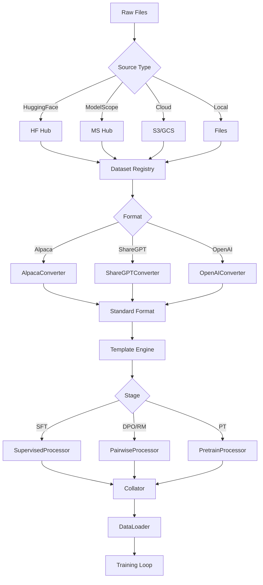

# Blog 3: The Data Pipeline: From Raw Data to Training Batches

**Analysis Commit SHA:** `45f0437`
**Reading Time:** ~10 minutes

---

## What You'll Learn

- How datasets are loaded from various sources
- The format conversion system (Alpaca, ShareGPT, etc.)
- Chat template engine and its importance
- Type-specific processors for different training stages
- Multimodal data handling

---

## Introduction

Data is the lifeblood of fine-tuning. But raw datasets come in countless formats, from different sources, with varying structures. LLaMA-Factory's data pipeline transforms this chaos into consistent, model-ready batches.

Let's trace a dataset's journey from disk to training loop.

---

## Pipeline Overview

```
Source Files → Loader → Converter → Template → Processor → Collator → DataLoader
   (JSON)     (HF/MS)   (Format)    (Chat)    (Stage)     (Batch)    (PyTorch)
```

Each stage has a clear responsibility:
- **Loader**: Fetch data from HuggingFace, ModelScope, S3, or local files
- **Converter**: Transform to standard format
- **Template**: Apply model-specific chat formatting
- **Processor**: Create training examples for the stage (SFT, DPO, etc.)
- **Collator**: Pad and batch for efficient GPU processing

---

## Stage 1: Dataset Loading

The loader handles multiple data sources:

```python
# src/llamafactory/data/loader.py (lines 50-100)
def get_dataset(
    template: "Template",
    model_args: "ModelArguments",
    data_args: "DataArguments",
    training_args: "TrainingArguments",
    stage: str,
    **kwargs,
) -> dict[str, Any]:
    # Get dataset info from registry
    dataset_info = load_dataset_info(data_args.dataset_dir)

    # Load each dataset
    all_datasets = []
    for dataset_name in data_args.dataset:
        dataset_attr = dataset_info[dataset_name]

        # Determine source
        if dataset_attr.hf_hub_url:
            # Load from HuggingFace Hub
            dataset = datasets.load_dataset(
                dataset_attr.hf_hub_url,
                split=dataset_attr.split,
            )
        elif dataset_attr.ms_hub_url:
            # Load from ModelScope
            dataset = load_from_modelscope(dataset_attr.ms_hub_url)
        elif dataset_attr.cloud_path:
            # Load from S3/GCS
            dataset = load_from_cloud(dataset_attr.cloud_path)
        else:
            # Load from local files
            dataset = load_from_local(dataset_attr.file_name)

        all_datasets.append(dataset)

    # Merge datasets
    return merge_datasets(all_datasets, data_args.mix_strategy)
```

[View source: loader.py](https://github.com/hiyouga/LLaMA-Factory/blob/45f0437/src/llamafactory/data/loader.py#L50-L100)

### Dataset Registry

Datasets are registered in `data/dataset_info.json`:

```json
{
  "alpaca_en": {
    "file_name": "alpaca_data_en.json",
    "columns": {
      "prompt": "instruction",
      "query": "input",
      "response": "output"
    }
  },
  "sharegpt_en": {
    "file_name": "sharegpt_en.json",
    "formatting": "sharegpt",
    "columns": {
      "messages": "conversations"
    }
  }
}
```

---

## Stage 2: Format Conversion

Different datasets use different formats. The converter system normalizes them:

### Supported Formats

| Format | Structure | Use Case |
|--------|-----------|----------|
| Alpaca | `{instruction, input, output}` | Simple Q&A |
| ShareGPT | `{conversations: [{from, value}]}` | Multi-turn chat |
| OpenAI | `{messages: [{role, content}]}` | API-compatible |
| Custom | User-defined columns | Anything else |

### Converter Implementation

```python
# src/llamafactory/data/converter.py (lines 80-150)
class AlpacaDatasetConverter(DatasetConverter):
    """Convert Alpaca format to standard format."""

    def __call__(self, examples):
        outputs = {"prompt": [], "response": [], "system": [], "tools": [], "images": [], "videos": [], "audios": []}

        for i in range(len(examples[self.dataset_attr.prompt])):
            prompt = examples[self.dataset_attr.prompt][i]
            query = examples.get(self.dataset_attr.query, [""])[i]
            response = examples[self.dataset_attr.response][i]

            # Build conversation
            content = f"{prompt}\n{query}" if query else prompt

            outputs["prompt"].append([{"role": "user", "content": content}])
            outputs["response"].append([{"role": "assistant", "content": response}])
            outputs["system"].append("")
            outputs["tools"].append("")

            # Handle multimodal content
            outputs["images"].append(self._find_medias(examples, i, "image"))
            outputs["videos"].append(self._find_medias(examples, i, "video"))
            outputs["audios"].append(self._find_medias(examples, i, "audio"))

        return outputs


class ShareGPTDatasetConverter(DatasetConverter):
    """Convert ShareGPT format to standard format."""

    def __call__(self, examples):
        outputs = {"prompt": [], "response": [], "system": [], "tools": [], "images": [], "videos": [], "audios": []}

        for i in range(len(examples[self.dataset_attr.messages])):
            messages = examples[self.dataset_attr.messages][i]

            # Parse conversation turns
            prompt_messages = []
            response_messages = []

            for j, message in enumerate(messages):
                role = message[self.dataset_attr.role]
                content = message[self.dataset_attr.content]

                # Map roles
                if role in ["human", "user"]:
                    prompt_messages.append({"role": "user", "content": content})
                elif role in ["gpt", "assistant"]:
                    response_messages.append({"role": "assistant", "content": content})
                elif role == "system":
                    outputs["system"].append(content)

            outputs["prompt"].append(prompt_messages)
            outputs["response"].append(response_messages)

        return outputs
```

[View source: converter.py](https://github.com/hiyouga/LLaMA-Factory/blob/45f0437/src/llamafactory/data/converter.py#L80-L150)

---

## Stage 3: Chat Templates

Each model family expects conversations in a specific format. The template system handles this:

```python
# src/llamafactory/data/template.py (lines 50-120)
@dataclass
class Template:
    format_user: "Formatter"
    format_assistant: "Formatter"
    format_system: "Formatter"
    format_tool: "Formatter"
    format_observation: "Formatter"
    format_function: "Formatter"
    format_prefix: "Formatter"
    default_system: str
    stop_words: list[str]
    efficient_eos: bool
    replace_eos: bool
    replace_jinja_template: bool

    def encode_oneturn(
        self,
        tokenizer: "PreTrainedTokenizer",
        messages: list[dict[str, str]],
        system: Optional[str] = None,
        tools: Optional[str] = None,
    ) -> tuple[list[int], list[int]]:
        """Encode a single conversation turn."""
        system = system or self.default_system

        # Format system message
        if system:
            encoded_system = tokenizer.encode(
                self.format_system.apply(content=system),
                add_special_tokens=False
            )
        else:
            encoded_system = []

        # Format conversation
        encoded_messages = []
        for message in messages:
            if message["role"] == "user":
                content = self.format_user.apply(content=message["content"])
            elif message["role"] == "assistant":
                content = self.format_assistant.apply(content=message["content"])
            # ... other roles

            encoded_messages.extend(tokenizer.encode(content, add_special_tokens=False))

        return encoded_system + encoded_messages
```

[View source: template.py](https://github.com/hiyouga/LLaMA-Factory/blob/45f0437/src/llamafactory/data/template.py#L50-L120)

### Example Templates

**LLaMA 3 Template:**
```python
# src/llamafactory/data/template.py (lines 500-550)
register_template(
    name="llama3",
    format_user=StringFormatter(
        slots=["<|start_header_id|>user<|end_header_id|>\n\n{{content}}<|eot_id|>"]
    ),
    format_assistant=StringFormatter(
        slots=["<|start_header_id|>assistant<|end_header_id|>\n\n{{content}}<|eot_id|>"]
    ),
    format_system=StringFormatter(
        slots=["<|start_header_id|>system<|end_header_id|>\n\n{{content}}<|eot_id|>"]
    ),
    default_system="You are a helpful assistant.",
    stop_words=["<|eot_id|>"],
)
```

**Qwen Template:**
```python
register_template(
    name="qwen",
    format_user=StringFormatter(
        slots=["<|im_start|>user\n{{content}}<|im_end|>\n"]
    ),
    format_assistant=StringFormatter(
        slots=["<|im_start|>assistant\n{{content}}<|im_end|>\n"]
    ),
    # ...
)
```

[View source: template.py](https://github.com/hiyouga/LLaMA-Factory/blob/45f0437/src/llamafactory/data/template.py#L500-L550)

---

## Stage 4: Dataset Processors

Each training stage needs data in a different format. Processors handle this:

### SFT Processor

```python
# src/llamafactory/data/processor/supervised.py (lines 30-100)
class SupervisedDatasetProcessor(DatasetProcessor):
    """Process dataset for supervised fine-tuning."""

    def process(self, examples):
        # Build prompt and response
        model_inputs = {"input_ids": [], "attention_mask": [], "labels": []}

        for i in range(len(examples["prompt"])):
            # Get conversation
            prompt = examples["prompt"][i]
            response = examples["response"][i]
            system = examples["system"][i]

            # Encode with template
            input_ids, labels = self.template.encode_oneturn(
                self.tokenizer,
                prompt + response,
                system=system,
            )

            # Create labels (mask prompt tokens)
            if not self.data_args.train_on_prompt:
                # Find where response starts
                prompt_len = len(self.template.encode_oneturn(
                    self.tokenizer, prompt, system=system
                )[0])
                labels[:prompt_len] = [IGNORE_INDEX] * prompt_len

            # Truncate if needed
            if len(input_ids) > self.data_args.cutoff_len:
                input_ids = input_ids[:self.data_args.cutoff_len]
                labels = labels[:self.data_args.cutoff_len]

            model_inputs["input_ids"].append(input_ids)
            model_inputs["attention_mask"].append([1] * len(input_ids))
            model_inputs["labels"].append(labels)

        return model_inputs
```

[View source: supervised.py](https://github.com/hiyouga/LLaMA-Factory/blob/45f0437/src/llamafactory/data/processor/supervised.py#L30-L100)

### Pairwise Processor (for DPO/RM)

```python
# src/llamafactory/data/processor/pairwise.py (lines 30-100)
class PairwiseDatasetProcessor(DatasetProcessor):
    """Process dataset for preference learning."""

    def process(self, examples):
        model_inputs = {
            "chosen_input_ids": [],
            "chosen_attention_mask": [],
            "chosen_labels": [],
            "rejected_input_ids": [],
            "rejected_attention_mask": [],
            "rejected_labels": [],
        }

        for i in range(len(examples["prompt"])):
            prompt = examples["prompt"][i]
            chosen = examples["response"][i]
            rejected = examples["rejected"][i]
            system = examples["system"][i]

            # Encode chosen response
            chosen_ids, chosen_labels = self.template.encode_oneturn(
                self.tokenizer,
                prompt + chosen,
                system=system,
            )

            # Encode rejected response
            rejected_ids, rejected_labels = self.template.encode_oneturn(
                self.tokenizer,
                prompt + rejected,
                system=system,
            )

            model_inputs["chosen_input_ids"].append(chosen_ids)
            model_inputs["rejected_input_ids"].append(rejected_ids)
            # ... labels and attention masks

        return model_inputs
```

[View source: pairwise.py](https://github.com/hiyouga/LLaMA-Factory/blob/45f0437/src/llamafactory/data/processor/pairwise.py#L30-L100)

---

## Stage 5: Data Collation

The collator pads sequences to the same length for batching:

```python
# src/llamafactory/data/collator.py (lines 30-80)
@dataclass
class SFTDataCollatorWith4DAttentionMask(DataCollatorForSeq2Seq):
    """Collator with support for 4D attention masks."""

    template: "Template"

    def __call__(self, features: list[dict[str, Any]]) -> dict[str, "torch.Tensor"]:
        # Pad sequences
        batch = self.tokenizer.pad(
            features,
            padding=self.padding,
            max_length=self.max_length,
            pad_to_multiple_of=self.pad_to_multiple_of,
            return_tensors="pt",
        )

        # Replace padding token in labels with -100
        if "labels" in batch:
            batch["labels"] = torch.where(
                batch["labels"] == self.tokenizer.pad_token_id,
                self.label_pad_token_id,
                batch["labels"],
            )

        # Create 4D attention mask if needed
        if self.block_diag_attn:
            batch["attention_mask"] = self._create_4d_attention_mask(batch)

        return batch
```

[View source: collator.py](https://github.com/hiyouga/LLaMA-Factory/blob/45f0437/src/llamafactory/data/collator.py#L30-L80)

---

## Multimodal Data Support

LLaMA-Factory handles images, audio, and video through a plugin system:

```python
# src/llamafactory/data/mm_plugin.py (lines 50-120)
class MultiModalPlugin:
    """Plugin for processing multimodal content."""

    def process_images(
        self,
        images: list[str],
        processor: "ProcessorMixin",
    ) -> dict[str, Any]:
        """Process image inputs."""
        loaded_images = []
        for image_path in images:
            if image_path.startswith("http"):
                # Load from URL
                response = requests.get(image_path)
                image = Image.open(BytesIO(response.content))
            else:
                # Load from local file
                image = Image.open(image_path)

            loaded_images.append(image)

        # Process with model's processor
        return processor(images=loaded_images, return_tensors="pt")

    def process_audio(self, audios: list[str], processor) -> dict[str, Any]:
        """Process audio inputs."""
        import librosa

        audio_arrays = []
        for audio_path in audios:
            audio_array, sr = librosa.load(audio_path, sr=16000)
            audio_arrays.append(audio_array)

        return processor(audios=audio_arrays, sampling_rate=16000)
```

[View source: mm_plugin.py](https://github.com/hiyouga/LLaMA-Factory/blob/45f0437/src/llamafactory/data/mm_plugin.py#L50-L120)

---

## Dataset Mixing Strategies

When using multiple datasets, LLaMA-Factory offers different mixing strategies:

```python
# src/llamafactory/data/data_utils.py (lines 30-80)
def merge_datasets(
    datasets: list["Dataset"],
    mix_strategy: str,
    interleave_probs: Optional[list[float]] = None,
) -> "Dataset":
    """Merge multiple datasets."""
    if len(datasets) == 1:
        return datasets[0]

    if mix_strategy == "concat":
        # Simple concatenation
        return concatenate_datasets(datasets)

    elif mix_strategy == "interleave_under":
        # Interleave, stopping when shortest exhausted
        return interleave_datasets(
            datasets,
            probabilities=interleave_probs,
            stopping_strategy="first_exhausted",
        )

    elif mix_strategy == "interleave_over":
        # Interleave, cycling through all
        return interleave_datasets(
            datasets,
            probabilities=interleave_probs,
            stopping_strategy="all_exhausted",
        )

    else:
        raise ValueError(f"Unknown mixing strategy: {mix_strategy}")
```

[View source: data_utils.py](https://github.com/hiyouga/LLaMA-Factory/blob/45f0437/src/llamafactory/data/data_utils.py#L30-L80)

---

## Efficient Packing

To maximize GPU utilization, LLaMA-Factory can pack multiple short sequences:

```python
# src/llamafactory/data/processor/supervised.py (lines 150-200)
def pack_sequences(self, examples):
    """Pack multiple short sequences into one."""
    packed_input_ids = []
    packed_labels = []
    packed_attention_mask = []

    current_ids = []
    current_labels = []
    current_position = 0

    for input_ids, labels in zip(examples["input_ids"], examples["labels"]):
        if len(current_ids) + len(input_ids) <= self.data_args.cutoff_len:
            # Add to current pack
            current_ids.extend(input_ids)
            current_labels.extend(labels)
        else:
            # Save current pack and start new one
            if current_ids:
                packed_input_ids.append(current_ids)
                packed_labels.append(current_labels)

            current_ids = input_ids[:]
            current_labels = labels[:]

    return {
        "input_ids": packed_input_ids,
        "labels": packed_labels,
        "attention_mask": [[1] * len(ids) for ids in packed_input_ids],
    }
```

---

## Complete Data Flow



---

## Key Takeaways

1. **Multi-Source Loading**: Unified interface for HuggingFace, ModelScope, cloud, and local files
2. **Format Normalization**: Converters transform diverse formats to a standard structure
3. **Template System**: Handles model-specific chat formatting declaratively
4. **Stage-Specific Processing**: Different processors for SFT, DPO, PPO requirements
5. **Efficient Batching**: Collators handle padding and packing for GPU efficiency
6. **Multimodal Support**: Plugin system for images, audio, and video

---

## What's Next

In [Blog 4: Patterns and Practices](./04-patterns-practices.md), we'll examine the design patterns, code organization strategies, and engineering practices that make LLaMA-Factory maintainable and extensible.

---

## References

- [HuggingFace Datasets](https://huggingface.co/docs/datasets)
- [Chat Templates Documentation](https://huggingface.co/docs/transformers/main/chat_templating)
