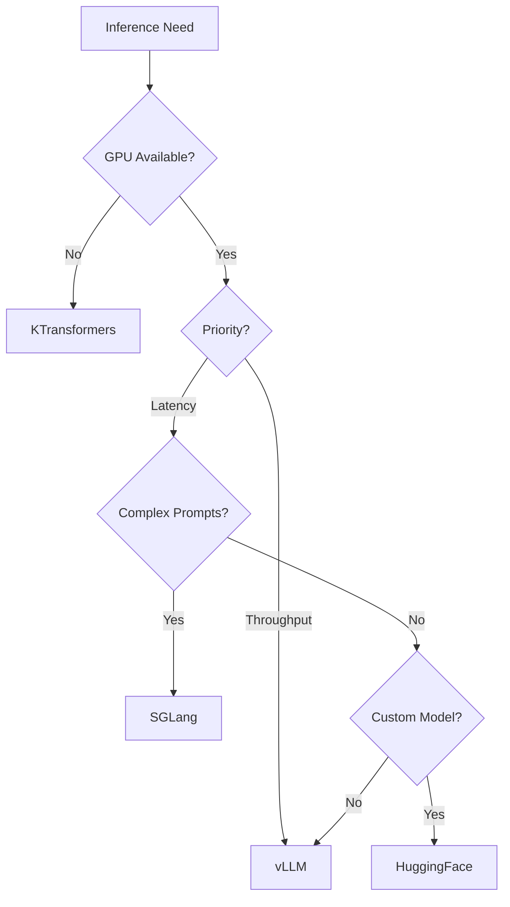

# Blog 6: Performance Analysis and Optimization

**Analysis Commit SHA:** `45f0437`
**Reading Time:** ~12 minutes

---

## What You'll Learn

- Memory optimization techniques available
- Quantization options and trade-offs
- Inference engine selection criteria
- Distributed training performance
- Benchmarking approaches

---

## Introduction

Fine-tuning LLMs is resource-intensive. A 7B parameter model needs ~28GB just for the weights in FP32. Add optimizer states, gradients, and activations, and you're looking at 100GB+ for full fine-tuning.

LLaMA-Factory provides numerous techniques to reduce these requirements while maintaining quality. Let's explore what's available and how to choose.

---

## Memory Optimization Landscape

Here's the hierarchy of memory optimization, from least to most aggressive:

```
Full Fine-Tuning (100% parameters)
    ↓ ~70% memory reduction
LoRA (0.1-1% parameters)
    ↓ ~50% additional reduction
QLoRA (4-bit base + LoRA)
    ↓ ~20% additional reduction
Gradient Checkpointing
    ↓ Variable reduction
DeepSpeed ZeRO
```

---

## Adapter-Based Fine-Tuning

### LoRA (Low-Rank Adaptation)

LoRA adds trainable low-rank matrices to frozen model weights:

```python
# Configuration
llamafactory-cli train \
    --model_name_or_path meta-llama/Llama-2-7b-hf \
    --finetuning_type lora \
    --lora_rank 8 \
    --lora_alpha 16 \
    --lora_dropout 0.05 \
    --lora_target q_proj,k_proj,v_proj,o_proj
```

**Memory Impact:**

| Model Size | Full FT | LoRA (r=8) | LoRA (r=64) |
|------------|---------|------------|-------------|
| 7B | ~84GB | ~18GB | ~22GB |
| 13B | ~156GB | ~32GB | ~40GB |
| 70B | ~840GB | ~160GB | ~200GB |

**Trade-offs:**
- Pro: Dramatic memory reduction
- Pro: Fast training (fewer parameters)
- Con: May not match full fine-tuning quality
- Con: Additional inference latency (can merge)

### QLoRA (Quantized LoRA)

Combines 4-bit quantization with LoRA:

```python
# Configuration
llamafactory-cli train \
    --model_name_or_path meta-llama/Llama-2-7b-hf \
    --finetuning_type lora \
    --quantization_bit 4 \
    --quantization_method bitsandbytes \
    --lora_rank 8
```

**Memory Impact:**

| Model Size | LoRA | QLoRA (4-bit) |
|------------|------|---------------|
| 7B | ~18GB | ~6GB |
| 13B | ~32GB | ~10GB |
| 70B | ~160GB | ~48GB |

**Trade-offs:**
- Pro: Can fine-tune 70B on single 80GB GPU
- Con: ~5-10% slower training
- Con: Slight quality degradation

[View quantization config](https://github.com/hiyouga/LLaMA-Factory/blob/45f0437/src/llamafactory/model/loader.py#L50-L80)

---

## Quantization Methods

LLaMA-Factory supports multiple quantization backends:

### BitsAndBytes (BNB)

```python
# 8-bit quantization
--quantization_bit 8
--quantization_method bitsandbytes

# 4-bit quantization (NF4)
--quantization_bit 4
--quantization_method bitsandbytes
--double_quant True  # Double quantization for more savings
```

### GPTQ

Post-training quantization with calibration:

```python
--quantization_method gptq
--quantization_bit 4
```

### AWQ

Activation-aware quantization:

```python
--quantization_method awq
--quantization_bit 4
```

### Comparison

| Method | Speed | Quality | Memory | Calibration |
|--------|-------|---------|--------|-------------|
| BNB 4-bit | Fast | Good | Best | No |
| GPTQ | Medium | Better | Good | Yes |
| AWQ | Fast | Best | Good | Yes |

---

## Gradient Optimization

### Gradient Checkpointing

Trade compute for memory by recomputing activations:

```python
--gradient_checkpointing True
```

**Impact:**
- Memory: ~30-50% reduction in activation memory
- Speed: ~20-30% slower (recomputation cost)

### Gradient Accumulation

Simulate larger batch sizes:

```python
--per_device_train_batch_size 2 \
--gradient_accumulation_steps 8
# Effective batch size: 2 * 8 = 16
```

**When to use:**
- When you can't fit desired batch size in memory
- For more stable training with larger effective batches

---

## Attention Optimizations

### FlashAttention-2

Memory-efficient attention algorithm:

```python
--flash_attn fa2
```

**Benefits:**
- O(N) memory instead of O(N²)
- 2-4x faster attention
- Enables longer contexts

**Requirements:**
- Ampere+ GPU (A100, RTX 3090+)
- Supported model architecture

### Shift-Short Attention (S²-Attn)

For long-context training:

```python
--shift_attn True
```

Shifts attention pattern to reduce KV cache pressure.

---

## Inference Engine Selection

### HuggingFace (Default)

Best for:
- Compatibility testing
- Small-scale inference
- Models without vLLM/SGLang support

```bash
llamafactory-cli api \
    --model_name_or_path meta-llama/Llama-2-7b-hf \
    --infer_backend huggingface
```

### vLLM

Best for:
- High-throughput production serving
- Batched inference
- When latency is less critical than throughput

```bash
llamafactory-cli api \
    --model_name_or_path meta-llama/Llama-2-7b-hf \
    --infer_backend vllm \
    --vllm_gpu_util 0.9
```

**Performance:**
- 3-24x higher throughput than HuggingFace
- PagedAttention for efficient KV cache
- Continuous batching

### SGLang

Best for:
- Speculative decoding scenarios
- Complex prompts with branching
- RadixAttention benefits

```bash
llamafactory-cli api \
    --model_name_or_path meta-llama/Llama-2-7b-hf \
    --infer_backend sglang
```

### KTransformers

Best for:
- CPU-only inference
- Edge deployment
- When GPU is unavailable

```bash
llamafactory-cli api \
    --model_name_or_path meta-llama/Llama-2-7b-hf \
    --infer_backend ktransformers \
    --use_kt True
```

### Engine Selection Guide



---

## Distributed Training

### Single-Node Multi-GPU

```bash
# Automatic detection
llamafactory-cli train config.yaml

# Explicit GPU count
CUDA_VISIBLE_DEVICES=0,1,2,3 llamafactory-cli train config.yaml
```

LLaMA-Factory uses torchrun for distributed training:

```python
# Automatically launched when multiple GPUs detected
torchrun --nproc_per_node 4 -m llamafactory.train config.yaml
```

### DeepSpeed Integration

For larger models and advanced sharding:

```python
# ZeRO Stage 2 (optimizer partitioning)
--deepspeed examples/deepspeed/ds_z2_config.json

# ZeRO Stage 3 (full sharding)
--deepspeed examples/deepspeed/ds_z3_config.json
```

**DeepSpeed ZeRO Stages:**

| Stage | What's Sharded | Use Case |
|-------|----------------|----------|
| ZeRO-1 | Optimizer states | 4x memory reduction |
| ZeRO-2 | + Gradients | 8x memory reduction |
| ZeRO-3 | + Parameters | Train 1T+ models |

### Multi-Node Training

```bash
# On each node
torchrun \
    --nnodes 2 \
    --nproc_per_node 8 \
    --node_rank $NODE_RANK \
    --master_addr $MASTER_ADDR \
    --master_port $MASTER_PORT \
    -m llamafactory.train config.yaml
```

---

## Performance Profiling

### Memory Tracking

Enable VRAM recording:

```bash
RECORD_VRAM=1 llamafactory-cli train config.yaml
```

This adds to training logs:
```json
{
  "vram_allocated": 12.34,
  "vram_reserved": 14.56
}
```

### Throughput Metrics

Training logs include throughput:

```json
{
  "throughput": 1234.56,  // tokens/second
  "total_tokens": 10000000
}
```

### Custom Profiling

```python
import torch
from torch.profiler import profile, ProfilerActivity

with profile(
    activities=[ProfilerActivity.CPU, ProfilerActivity.CUDA],
    record_shapes=True,
    profile_memory=True,
) as prof:
    # Run training step
    trainer.training_step(model, inputs)

print(prof.key_averages().table(sort_by="cuda_memory_usage"))
```

---

## Optimization Recipes

### Recipe 1: Maximum Memory Efficiency (7B on 16GB GPU)

```yaml
# config.yaml
model_name_or_path: meta-llama/Llama-2-7b-hf
finetuning_type: lora
quantization_bit: 4
quantization_method: bitsandbytes
lora_rank: 8
lora_target: q_proj,v_proj

gradient_checkpointing: true
per_device_train_batch_size: 1
gradient_accumulation_steps: 16

flash_attn: fa2
```

### Recipe 2: Maximum Speed (Fast Iteration)

```yaml
# config.yaml
model_name_or_path: meta-llama/Llama-2-7b-hf
finetuning_type: lora
lora_rank: 16

# No quantization for speed
gradient_checkpointing: false
per_device_train_batch_size: 8
bf16: true
flash_attn: fa2

# Fewer logging calls
logging_steps: 100
save_steps: 1000
```

### Recipe 3: Maximum Quality (Full Fine-Tuning)

```yaml
# config.yaml
model_name_or_path: meta-llama/Llama-2-7b-hf
finetuning_type: full

# Use DeepSpeed for memory
deepspeed: examples/deepspeed/ds_z3_config.json

per_device_train_batch_size: 2
gradient_accumulation_steps: 8
bf16: true
flash_attn: fa2

# Longer training
num_train_epochs: 3
learning_rate: 2e-5
warmup_ratio: 0.1
```

### Recipe 4: Long Context (32K+)

```yaml
# config.yaml
model_name_or_path: meta-llama/Llama-2-7b-hf
finetuning_type: lora
quantization_bit: 4

# Long context optimizations
cutoff_len: 32768
shift_attn: true
flash_attn: fa2
neat_packing: true

gradient_checkpointing: true
per_device_train_batch_size: 1
```

---

## Benchmarking Approach

### Training Throughput

```python
# benchmark_train.py
import time
from llamafactory.train.tuner import run_exp

configs = [
    {"name": "baseline", "config": {...}},
    {"name": "with_fa2", "config": {..., "flash_attn": "fa2"}},
    {"name": "with_qlora", "config": {..., "quantization_bit": 4}},
]

results = []
for cfg in configs:
    start = time.time()
    run_exp(cfg["config"])
    elapsed = time.time() - start

    # Read metrics from training log
    metrics = load_training_metrics(cfg["config"]["output_dir"])

    results.append({
        "name": cfg["name"],
        "time": elapsed,
        "throughput": metrics["throughput"],
        "memory": metrics["vram_allocated"],
    })

print_comparison_table(results)
```

### Inference Latency

```python
# benchmark_inference.py
import time
from llamafactory.chat import ChatModel

model = ChatModel(args)
messages = [{"role": "user", "content": "Hello, how are you?"}]

# Warmup
for _ in range(5):
    model.chat(messages)

# Benchmark
latencies = []
for _ in range(100):
    start = time.time()
    response = model.chat(messages)
    latencies.append(time.time() - start)

print(f"Mean latency: {sum(latencies)/len(latencies)*1000:.2f}ms")
print(f"P99 latency: {sorted(latencies)[99]*1000:.2f}ms")
```

---

## Performance Bottlenecks

Based on our analysis, here are common bottlenecks:

### 1. Data Loading

Symptom: GPU utilization spikes and drops

Solution:
```yaml
preprocessing_num_workers: 8
dataloader_num_workers: 4
dataloader_pin_memory: true
```

### 2. Tokenizer Speed

Symptom: Slow preprocessing

Solution:
```yaml
use_fast_tokenizer: true
```

### 3. Checkpointing Frequency

Symptom: Regular slowdowns every N steps

Solution:
```yaml
save_steps: 1000  # Less frequent
save_total_limit: 3  # Keep fewer checkpoints
```

### 4. Logging Overhead

Symptom: Consistent small slowdowns

Solution:
```yaml
logging_steps: 50  # Less frequent
report_to: []  # Disable external logging during benchmarks
```

---

## Hardware-Specific Recommendations

### Consumer GPUs (RTX 3090, 4090)

- **Memory**: 24GB VRAM
- **Recommendation**: QLoRA with 4-bit quantization
- **Max Model**: 13B (QLoRA) or 7B (LoRA)

```yaml
quantization_bit: 4
lora_rank: 8
per_device_train_batch_size: 1
gradient_accumulation_steps: 16
flash_attn: fa2
```

### Workstation GPUs (A6000, L40)

- **Memory**: 48GB VRAM
- **Recommendation**: LoRA without quantization for speed
- **Max Model**: 30B (LoRA) or 13B (full)

```yaml
lora_rank: 16
per_device_train_batch_size: 4
bf16: true
flash_attn: fa2
```

### Data Center GPUs (A100, H100)

- **Memory**: 80GB VRAM
- **Recommendation**: Higher batch sizes, optional DeepSpeed
- **Max Model**: 70B (LoRA) or 30B (full)

```yaml
lora_rank: 32
per_device_train_batch_size: 8
bf16: true
flash_attn: fa2
# For 70B full fine-tuning:
# deepspeed: examples/deepspeed/ds_z3_config.json
```

### Multi-GPU Clusters

For multi-node training:

```yaml
deepspeed: examples/deepspeed/ds_z3_config.json
gradient_checkpointing: true
per_device_train_batch_size: 2
gradient_accumulation_steps: 4
```

Use NCCL for fast GPU communication and ensure high-bandwidth interconnects (NVLink, InfiniBand).

---

## Cost Optimization

### Cloud Training Tips

1. **Use spot/preemptible instances**: 60-80% cost savings
2. **Enable checkpointing**: Resume after preemption
3. **Right-size instances**: Don't over-provision VRAM
4. **Use gradient accumulation**: Smaller instances with larger effective batch

### Training Time Estimates

| Model | Method | Hardware | Time (1000 steps) |
|-------|--------|----------|-------------------|
| 7B | QLoRA | RTX 4090 | ~30 min |
| 7B | LoRA | A100 | ~15 min |
| 13B | QLoRA | A100 | ~25 min |
| 70B | QLoRA | 4x A100 | ~60 min |

---

## Key Takeaways

1. **Start with QLoRA**: Best memory/quality trade-off for most cases
2. **Always use FlashAttention-2**: Free performance on supported GPUs
3. **Choose inference engine by use case**: vLLM for throughput, HF for compatibility
4. **Profile before optimizing**: RECORD_VRAM and throughput metrics
5. **DeepSpeed for scale**: ZeRO-3 enables training models larger than GPU memory
6. **Batch appropriately**: Use gradient accumulation to simulate larger batches

---

## Conclusion

LLaMA-Factory provides a comprehensive toolkit for optimizing LLM fine-tuning across the performance spectrum. Whether you're running on a consumer GPU or a cluster of A100s, there's a configuration that will work.

The key is understanding the trade-offs—memory vs speed, quality vs efficiency—and choosing the right combination for your specific needs.

---

## References

- [vLLM Paper](https://arxiv.org/abs/2309.06180)
- [QLoRA Paper](https://arxiv.org/abs/2305.14314)
- [FlashAttention-2](https://arxiv.org/abs/2307.08691)
- [DeepSpeed ZeRO](https://www.deepspeed.ai/tutorials/zero/)
- [PEFT Library](https://huggingface.co/docs/peft)
