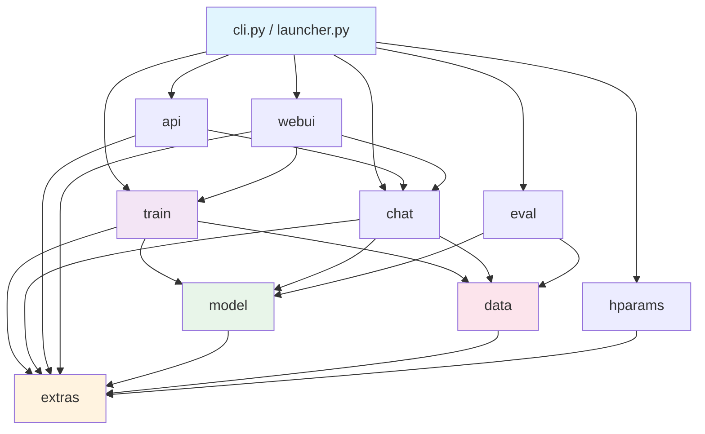
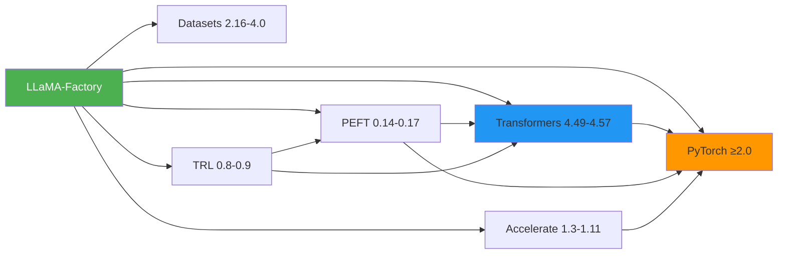
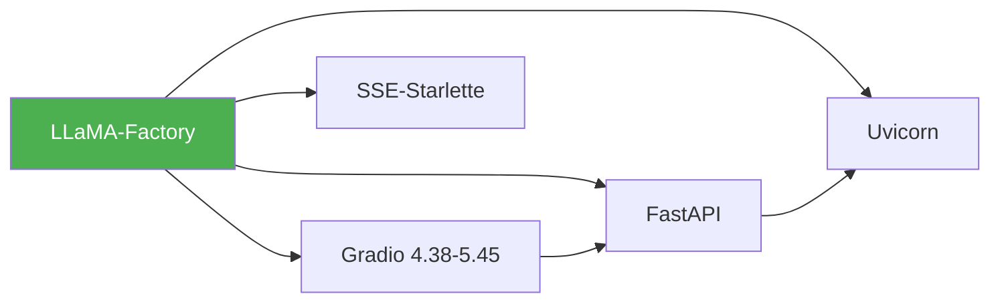
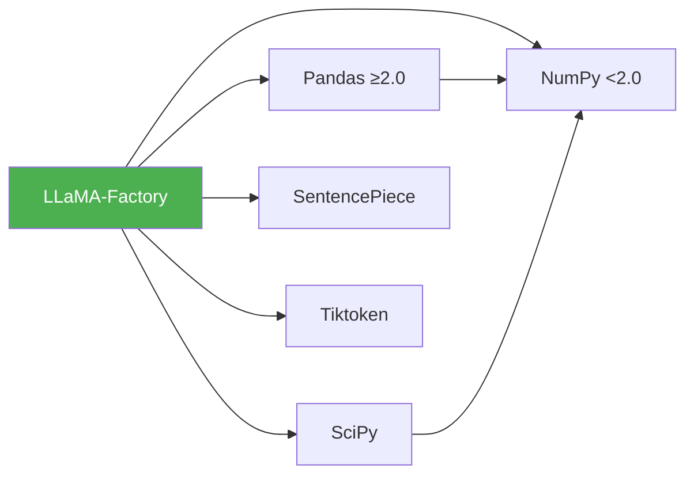
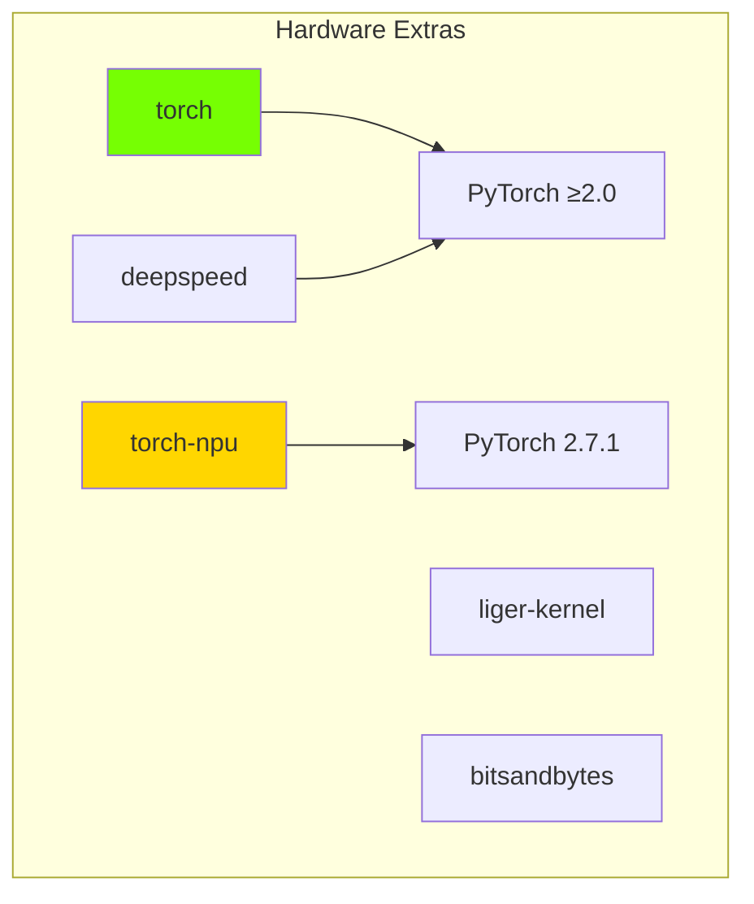
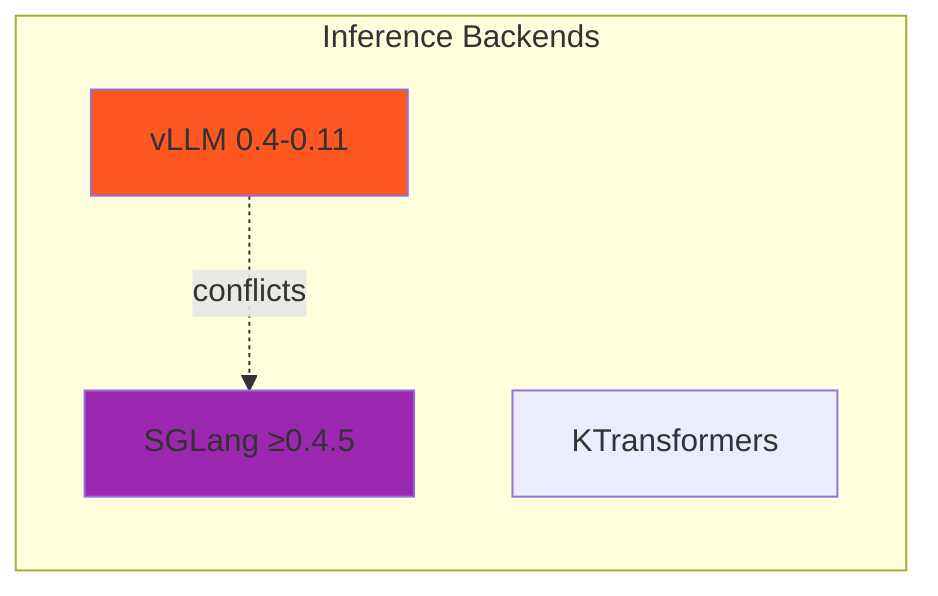
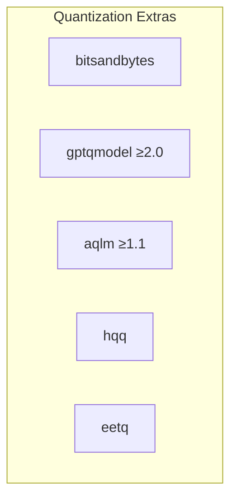
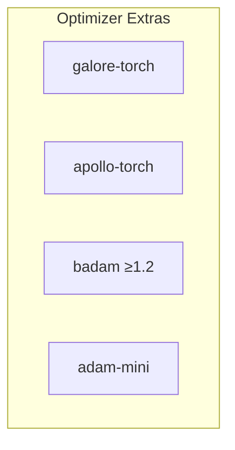

# Dependency Graph

**Analysis Commit SHA:** `45f0437`

---

## Internal Module Dependencies

### Dependency Flow (Top to Bottom)



### Layer Architecture

```
┌─────────────────────────────────────────────────┐
│              Entry Points (Layer 1)             │
│         cli.py, launcher.py, api/app.py         │
└──────────────────────┬──────────────────────────┘
                       │
┌──────────────────────▼──────────────────────────┐
│            Application Layer (Layer 2)          │
│     train/, chat/, webui/, eval/, api/          │
└──────────────────────┬──────────────────────────┘
                       │
┌──────────────────────▼──────────────────────────┐
│              Domain Layer (Layer 3)             │
│           model/, data/, hparams/               │
└──────────────────────┬──────────────────────────┘
                       │
┌──────────────────────▼──────────────────────────┐
│           Infrastructure Layer (Layer 4)        │
│                    extras/                      │
└─────────────────────────────────────────────────┘
```

---

## External Dependencies

### Core ML Framework Dependencies



### Web & API Dependencies



### Data Processing Dependencies



---

## Optional Dependencies (Extras)

### Hardware Acceleration



### Inference Engines



### Quantization Methods



### Optimizers



---

## Dependency Conflicts

The following combinations are explicitly prohibited:

```
torch-npu ❌ aqlm
torch-npu ❌ vllm
torch-npu ❌ sglang
vllm ❌ sglang
```

These conflicts are defined in `pyproject.toml` under `[tool.uv.conflicts]`.

---

## Import Relationships

### Most Imported Modules

| Module | Import Count | Role |
|--------|-------------|------|
| `extras` | 79 | Utilities, logging, constants |
| `hparams` | 49 | Configuration dataclasses |
| `data` | 22 | Dataset handling |
| `model` | 17 | Model loading |
| `trainer_utils` | 13 | Training utilities |

### Import Chain Analysis

**Maximum Chain Depth**: 4 levels

```
cli → train → model → extras
cli → webui → train → model
cli → api → chat → model
```

**Circular Import Risk**: None detected ✅

---

## Version Compatibility Matrix

### Python Version Support

| Python | Status | Notes |
|--------|--------|-------|
| 3.9 | ✅ Supported | Some macOS issues |
| 3.10 | ✅ Supported | Primary target |
| 3.11 | ✅ Supported | Good performance |
| 3.12 | ✅ Supported | Latest features |

### Transformers Version Support

| Transformers | Python 3.9 | Python 3.10+ |
|-------------|------------|--------------|
| 4.49.0 | ✅ | ✅ |
| 4.51.0 | ✅ | ✅ |
| 4.53.0 | ✅ | ✅ |
| 4.57.1 | ❌ | ✅ |

Note: `transformers>=4.49.0,<=4.56.2` for Python < 3.10

---

## Dependency Update Strategy

### Version Pinning Philosophy

1. **Core ML (Tight Ranges)**
   - Reason: Breaking API changes common
   - Example: `transformers>=4.49.0,<=4.57.1`

2. **Utilities (Loose/None)**
   - Reason: Stable APIs
   - Example: `fire`, `scipy`

3. **Hardware-Specific (Exact)**
   - Reason: Binary compatibility
   - Example: `torch==2.7.1` (NPU)

### Security Considerations

- Excluded versions with known issues:
  - `transformers!=4.52.0,!=4.57.0`
  - `propcache!=0.4.0`
- NumPy capped at `<2.0.0` for API stability

---

## Recommended Dependency Audit

### Check for:

1. **Abandoned packages**: None detected
2. **Security vulnerabilities**: Run `pip-audit` regularly
3. **License compatibility**: All Apache/MIT/BSD compatible
4. **Outdated packages**: Update quarterly

### Suggested Commands

```bash
# Security audit
pip-audit

# Check for updates
pip list --outdated

# License check
pip-licenses --format=markdown
```
