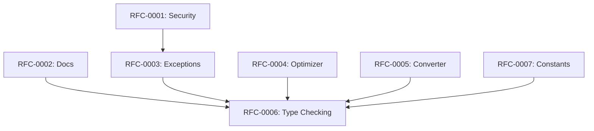

# RFC Prioritization Matrix

**Analysis Commit SHA:** `45f0437`
**Date:** 2025-11-18

---

## Overview

This document prioritizes proposed improvements based on impact vs. effort analysis. RFCs are categorized into three tiers:

- **Quick Wins**: < 1 week effort, immediate value
- **Strategic**: 2-4 weeks, significant impact
- **Long-term**: > 1 month, architectural changes

---

## Impact/Effort Matrix

```
High Impact │
            │  [RFC-0006]        [RFC-0003]
            │  Type Checking     Custom Exceptions
            │
            │  [RFC-0001]        [RFC-0004]
            │  Security Fixes    Optimizer Refactor
            │
Medium      │  [RFC-0007]        [RFC-0005]
Impact      │  Constants Split   Converter Refactor
            │
            │  [RFC-0002]
            │  Module Docs
            │
Low Impact  │
            └─────────────────────────────────────────
              Low Effort    Medium Effort    High Effort
```

---

## Quick Wins (< 1 week)

| RFC | Title | Impact | Effort | Priority |
|-----|-------|--------|--------|----------|
| [RFC-0001](./RFC-0001-security-hardening.md) | API Security Hardening | High | 1-2 days | **Critical** |
| [RFC-0002](./RFC-0002-module-documentation.md) | Module Documentation | Medium | 2-3 days | High |

**Total Estimated Effort**: 3-5 dev-days

---

## Strategic (2-4 weeks)

| RFC | Title | Impact | Effort | Priority |
|-----|-------|--------|--------|----------|
| [RFC-0003](./RFC-0003-exception-hierarchy.md) | Custom Exception Hierarchy | High | 1 week | High |
| [RFC-0004](./RFC-0004-optimizer-builder.md) | Optimizer Builder Pattern | Medium-High | 1 week | Medium |
| [RFC-0005](./RFC-0005-converter-refactor.md) | Data Converter Refactoring | Medium | 1.5 weeks | Medium |

**Total Estimated Effort**: 15-20 dev-days

---

## Long-term (> 1 month)

| RFC | Title | Impact | Effort | Priority |
|-----|-------|--------|--------|----------|
| [RFC-0006](./RFC-0006-type-checking.md) | Type Checking with Mypy | High | 3-4 weeks | Medium |
| [RFC-0007](./RFC-0007-constants-refactor.md) | Constants Module Refactoring | Medium | 2 weeks | Low |
| [RFC-0008](./RFC-0008-coverage-enforcement.md) | Test Coverage Enforcement | Medium | 2-3 weeks | Low |

**Total Estimated Effort**: 35-45 dev-days

---

## Recommended Implementation Order

### Phase 1: Critical Security (Week 1)
1. **RFC-0001**: Security Hardening
   - Fix 5 critical vulnerabilities
   - No breaking changes
   - Immediate risk reduction

### Phase 2: Foundation (Weeks 2-3)
2. **RFC-0002**: Module Documentation
   - Improves onboarding
   - Required for other RFCs

3. **RFC-0003**: Exception Hierarchy
   - Better error handling
   - Clearer debugging

### Phase 3: Code Quality (Weeks 4-6)
4. **RFC-0004**: Optimizer Builder
   - Reduces duplication
   - Easier maintenance

5. **RFC-0005**: Converter Refactoring
   - Reduces complexity
   - Improves readability

### Phase 4: Maintainability (Months 2-3)
6. **RFC-0006**: Type Checking
   - Catches bugs early
   - Better IDE support

7. **RFC-0007**: Constants Refactoring
   - Better organization
   - Easier navigation

8. **RFC-0008**: Coverage Enforcement
   - Quality assurance
   - Regression prevention

---

## Success Criteria Summary

| RFC | Primary Success Metric |
|-----|------------------------|
| RFC-0001 | Zero critical security issues in audit |
| RFC-0002 | 100% module-level documentation |
| RFC-0003 | All errors use custom exception classes |
| RFC-0004 | Code duplication < 2% |
| RFC-0005 | Max nesting depth < 5 |
| RFC-0006 | Zero mypy errors in strict mode |
| RFC-0007 | No file > 1000 LOC |
| RFC-0008 | 80%+ test coverage |

---

## Dependencies Between RFCs



---

## Resource Requirements

### Personnel
- 1 senior developer (lead)
- 1 mid-level developer (implementation)
- 1 QA engineer (testing)

### Time Investment
- Phase 1: 5 dev-days
- Phase 2: 10 dev-days
- Phase 3: 15 dev-days
- Phase 4: 40 dev-days
- **Total**: ~70 dev-days (3-4 months with single developer)

### Infrastructure
- CI/CD pipeline updates
- Security scanning tools
- Type checking integration

---

## Risk Assessment

| RFC | Risk Level | Primary Risk | Mitigation |
|-----|------------|--------------|------------|
| RFC-0001 | Low | None | Well-contained changes |
| RFC-0002 | Low | Incomplete docs | Require review |
| RFC-0003 | Medium | Breaking changes | Careful migration |
| RFC-0004 | Low | Regression | Comprehensive tests |
| RFC-0005 | Medium | Logic bugs | Extensive testing |
| RFC-0006 | High | Large scope | Incremental adoption |
| RFC-0007 | Low | Import changes | Maintain aliases |
| RFC-0008 | Low | False sense of security | Focus on meaningful tests |

---

## Stakeholder Approvals Needed

| RFC | Maintainers | Security | Community |
|-----|-------------|----------|-----------|
| RFC-0001 | ✓ Required | ✓ Required | Optional |
| RFC-0002 | ✓ Required | - | Optional |
| RFC-0003 | ✓ Required | - | ✓ Feedback |
| RFC-0004 | ✓ Required | - | Optional |
| RFC-0005 | ✓ Required | - | Optional |
| RFC-0006 | ✓ Required | - | ✓ Feedback |
| RFC-0007 | ✓ Required | - | ✓ Feedback |
| RFC-0008 | ✓ Required | - | Optional |
